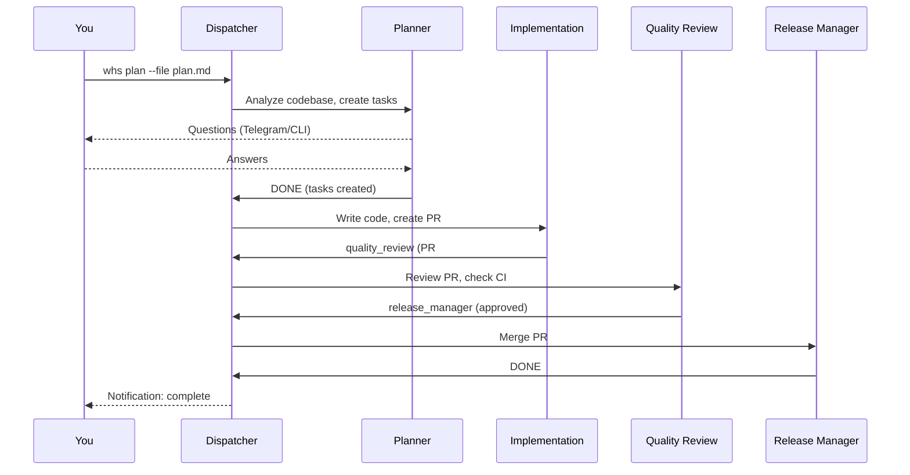
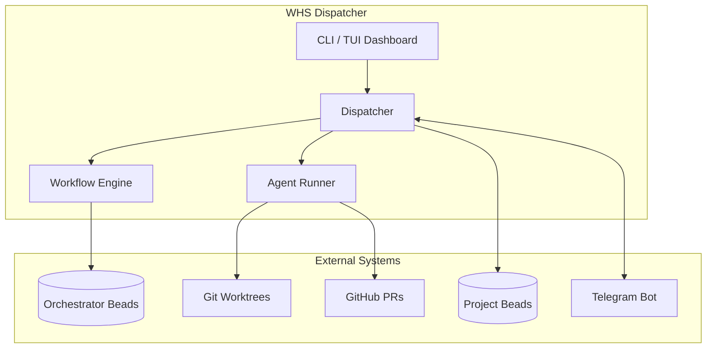
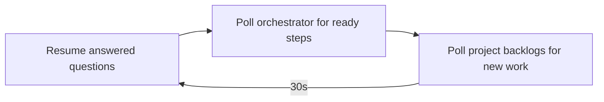
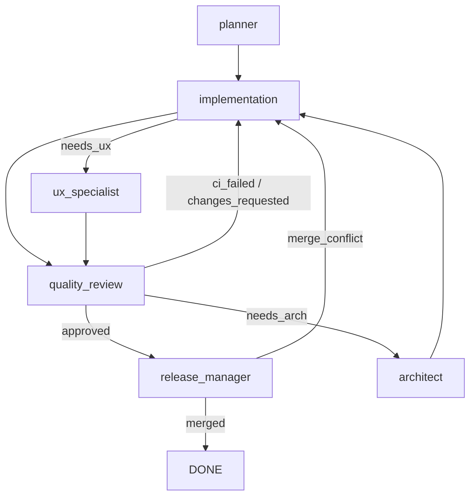

# While Humans Sleep

> Multi-project AI agent dispatcher using Claude and Beads

An automated system that orchestrates AI agents working across multiple projects. Agents pick up tasks from your backlog, implement features, create PRs, review code, and hand off to each other — all while you sleep.

## How It Works



## Features

- **Multi-project support** — Manage agents across multiple codebases simultaneously
- **Beads integration** — Git-backed task tracking with dependency graphs
- **Workflow orchestration** — Automatic agent handoffs via orchestrator beads
- **Git worktrees** — Parallel work with isolated branches per task
- **Question handling** — Agents ask questions when stuck, you answer via CLI or Telegram
- **Planning workflow** — Agents decompose features into tasks before implementation
- **Plan from file** — Feed existing plan documents to the planner (`whs plan --file`)
- **TUI dashboard** — Ink-based terminal UI showing agent panels, logs, and status bar
- **Telegram bot** — Remote control and question answering from your phone
- **Health checks** — Pre-start diagnostics with `whs doctor`
- **Error recovery** — Auto-retry errored workflows, manual retry with `whs retry`
- **Pause/resume** — Pause the dispatcher via CLI or Telegram, running agents finish gracefully
- **PR feedback routing** — Routes PR comments back to implementation before quality review
- **Merge conflict detection** — CI poller detects merge conflicts and routes to implementation
- **Auto-cleanup** — Merged worktrees are periodically cleaned up
- **Agent activity logging** — Per-step JSONL logs for debugging agent behavior
- **Cost tracking** — Per-step, per-workflow, per-project metrics in SQLite
- **Crash recovery** — State persisted to disk, survives restarts
- **Safety hooks** — Blocks dangerous commands, confines agents to worktrees

## Quick Start

### Prerequisites

- Node.js 20+
- [Beads CLI](https://github.com/steveyegge/beads) installed (`npm install -g @beads/bd`)
- [Worktrunk](https://worktrunk.dev/) for worktree management
- Claude authentication — either:
  - **OAuth token** (recommended) — Uses your Claude subscription (Pro/Max)
  - **API key** — Pay-per-use from [console.anthropic.com](https://console.anthropic.com/)

### Installation

```bash
# Clone and install
git clone https://github.com/yourusername/while-humans-sleep
cd while-humans-sleep
npm install
npm run build

# Link for global use
npm link
```

### Setup

```bash
# 1. Initialize WHS (includes Claude authentication setup)
whs init

# 2. Run health checks
whs doctor

# 3. Add a project
whs add myproject ~/work/myproject

# 4. Create some tasks (in your project directory)
cd ~/work/myproject
bd create "Add user authentication" -p 1 -t task
bd create "Fix login bug" -p 0 -t bug

# 5. Start the dispatcher (opens TUI dashboard)
whs start
```

## System Architecture



## CLI Commands

### Core Operations

#### `whs init`

Initialize WHS (run once before adding projects).

```bash
whs init                                    # Use default orchestrator location
whs init --orchestrator ~/my/whs-orch       # Custom orchestrator location
```

This creates:
- `.whs/config.json` — Configuration file
- Orchestrator directory with git + beads initialized
- Beads daemon running with sync-branch configured

#### `whs claude-login`

Set up Claude authentication for WHS agents. Automatically run during `whs init`, but can be re-run to change authentication.

```bash
whs claude-login                            # Interactive setup (choose OAuth or API key)
whs claude-login --api-key sk-ant-api...    # Use an Anthropic API key directly
whs claude-login --oauth-token sk-ant-oa... # Use an OAuth token directly
```

**Authentication options:**
- **OAuth token** (recommended) — Uses your Claude subscription. Run `claude setup-token`, authenticate in browser, paste the token.
- **API key** — Pay-per-use from [console.anthropic.com](https://console.anthropic.com/)

Credentials are saved to `.whs/.env` and automatically loaded by WHS agents.

#### `whs start`

Start the dispatcher. Opens an ink-based TUI dashboard showing agent panels, log stream, and status bar.

```bash
whs start                # Start with TUI dashboard
whs start --no-tui       # Plain console output (no dashboard)
```

The dispatcher:
1. Polls project beads for ready tasks (no blocking dependencies)
2. Creates workflow epics in the orchestrator
3. Dispatches agents in isolated worktrees
4. Processes handoffs between agents
5. Handles questions and errors
6. Periodically cleans up merged worktrees

Press `Ctrl+C` to stop gracefully.

#### `whs stop`

Stop the dispatcher gracefully. Running agents finish their current turn.

```bash
whs stop                 # Stop the running dispatcher
whs stop --force         # Force stop immediately
```

#### `whs restart`

Gracefully restart the dispatcher — waits for running agents to finish, then restarts.

```bash
whs restart
```

#### `whs pause` / `whs resume`

Pause the dispatcher (running agents finish, no new work is picked up) or resume after a pause.

```bash
whs pause
whs resume
```

### Planning & Tasks

#### `whs plan`

Start planning a new feature. Creates a planning workflow that analyzes your codebase, asks clarifying questions, and creates implementation tasks with dependencies.

```bash
whs plan                                            # Interactive: select project, enter description
whs plan "add user authentication with JWT"         # With description
whs plan --file docs/plans/auth-plan.md             # Feed a plan document to the planner
whs plan --file plan.md --parallel                  # Create parallel (non-dependent) tasks
whs plan --priority 0                               # Set priority (0=critical, 4=low)
```

This creates:
1. A blocked epic in the project's beads
2. A planning task that blocks the epic
3. When the planner completes, implementation tasks are created

#### `whs import <file>`

Import stories from a planning document into beads as tasks.

```bash
whs import docs/plans/feature-stories.md
```

### Questions

#### `whs answer <questionId> <answer>`

Answer a pending question from an agent. The dispatcher resumes the agent with your answer.

```bash
whs answer q-1234567890 "use JWT with refresh tokens"
```

#### `whs chat`

Interactive mode for answering dispatcher questions. Shows pending questions and lets you answer them in a conversational flow.

```bash
whs chat                   # Interactive Q&A
whs chat --project myproj  # Filter to one project
```

#### `whs questions`

List all pending questions from agents.

```bash
whs questions
```

### Diagnostics

#### `whs doctor`

Pre-start health check. Verifies beads daemons, daemon errors, errored/blocked workflows, CI-pending PR status, orphaned worktrees, and state sanity. Exit code 1 on failures.

```bash
whs doctor
```

#### `whs status`

Show dispatcher status. Without arguments, shows uptime, active work count, and today's cost. With a step ID, shows detailed info including agent, duration, cost, PR link, and recent activity log.

```bash
whs status                          # Overview
whs status --active                 # Show only active work
whs status --questions              # Show pending questions
whs status orc-zwx.3               # Detail for a specific step
whs status bridget_ai/bai-zv0.4    # By source bead
whs status pr:46                   # By PR number
```

#### `whs retry [epic-id]`

Retry errored or blocked workflows. Without arguments, auto-retries all errored workflows. With an epic ID, retries a specific workflow.

```bash
whs retry                  # Auto-retry all errored workflows
whs retry orc-abc.1        # Retry a specific workflow
```

### Setup & Configuration

#### `whs add [path]`

Register a project with the dispatcher (interactive setup).

```bash
whs add ~/work/myproject
whs add ~/work/myproject --base-branch develop
whs add ~/work/myproject --beads-mode stealth
```

Options:
- `--base-branch <branch>` — Base branch for worktrees (default: main)
- `--agents-path <path>` — Path to agent definitions (default: docs/llm/agents)
- `--beads-mode <mode>` — "committed" or "stealth" (default: committed)

#### `whs remove <name>`

Remove a project from management.

```bash
whs remove myproject
```

#### `whs list`

List all configured projects.

```bash
whs list
```

#### `whs config`

Show configuration info.

```bash
whs config
```

#### `whs setup hooks [project]`

Analyze a project and suggest worktrunk worktree hooks (e.g., `post-create = "npm ci"`).

```bash
whs setup hooks
whs setup hooks myproject
```

#### `whs setup review [project]`

Set up structured code review format for a project. Propagates the review format doc and CI prompt.

```bash
whs setup review
whs setup review myproject --write   # Non-interactive
```

### Telegram Integration

#### `whs telegram setup`

Interactive setup wizard for the Telegram bot. Guides you through creating a bot with BotFather and configuring your chat ID.

```bash
whs telegram setup
```

#### `whs telegram status` / `enable` / `disable`

Manage Telegram integration.

```bash
whs telegram status      # Show connection status
whs telegram enable      # Enable notifications
whs telegram disable     # Disable (switch to CLI notifications)
```

**Telegram bot commands** (once set up):
- `/status` — Show dispatcher status, active work, pending questions
- `/status <step>` — Detailed info for a specific step
- `/pause` — Pause the dispatcher
- `/resume` — Resume the dispatcher
- `/doctor` — Run health checks
- `/retry` — Retry all errored workflows
- `/retry <id>` — Retry a specific workflow

Answer agent questions by replying to the question message or tapping inline buttons.

## How the Dispatcher Works



On each tick (every 30 seconds), the dispatcher:
1. **Resumes answered questions** — picks up paused agents with new answers
2. **Polls orchestrator beads** — dispatches ready workflow steps (handoffs from previous agents)
3. **Polls project backlogs** — starts new workflows for unblocked tasks (if under capacity)

## Agents

WHS includes six specialized agents:

| Agent | Role | Typical Handoffs |
|-------|------|------------------|
| `planner` | Plans features, creates subtasks | DONE |
| `implementation` | Writes code, creates PRs | quality_review |
| `quality_review` | Reviews PRs, checks CI | release_manager or implementation |
| `release_manager` | Merges approved PRs | DONE |
| `ux_specialist` | UI/UX focused work | quality_review |
| `architect` | Technical escalation | implementation or BLOCKED |

### Agent Workflow



### Handoff Format

Agents output handoffs in YAML format:

```yaml
next_agent: quality_review
pr_number: 42
ci_status: pending
context: |
  Implemented JWT authentication.

  Changes:
  - Added auth middleware
  - Created login/logout endpoints
  - Added tests

  Ready for review.
```

## Configuration

Configuration is stored in `.whs/config.json` (in the orchestrator directory):

```json
{
  "projects": [
    {
      "name": "myproject",
      "repoPath": "/home/user/work/myproject",
      "baseBranch": "main",
      "agentsPath": "docs/llm/agents",
      "beadsMode": "committed"
    }
  ],
  "orchestratorPath": "~/work/whs-orchestrator",
  "concurrency": {
    "maxTotal": 4,
    "maxPerProject": 2
  },
  "notifier": "cli"
}
```

### Concurrency Settings

- `maxTotal` — Maximum concurrent agent runs across all projects
- `maxPerProject` — Maximum concurrent runs per project (prevents git conflicts)

## TUI Dashboard

`whs start` renders an ink-based terminal dashboard with:

- **Agent panels** — One panel per active agent showing status, current step, and recent output
- **Log stream** — Scrolling log of dispatcher events
- **Status bar** — Uptime, active work count, and cost

Use `whs start --no-tui` for plain console output (useful for logging to files or running in tmux).

## Telegram Integration

The Telegram bot provides remote control and question answering from your phone.

### Setup

```bash
whs telegram setup
```

The setup wizard walks you through:
1. Creating a bot with [@BotFather](https://t.me/BotFather) on Telegram
2. Getting your chat ID
3. Saving the bot token securely to `.whs/.env`

### Bot Commands

| Command | Description |
|---------|-------------|
| `/status` | Show dispatcher status and active work |
| `/status <step>` | Detailed info for a specific step |
| `/pause` | Pause the dispatcher |
| `/resume` | Resume after pause |
| `/doctor` | Run health checks |
| `/retry` | Auto-retry errored workflows |
| `/retry <id>` | Retry a specific workflow |

### Answering Questions

When an agent asks a question, the bot sends it as a message with inline answer buttons. You can:
- Tap a button to select a suggested answer
- Reply to the message with a custom answer

## Beads Integration

### Project Beads

Each project has its own `.beads/` directory tracking tasks:

```bash
# Create tasks
bd create "Add feature X" -p 1 -t task
bd create "Fix bug Y" -p 0 -t bug

# Set dependencies
bd dep add child-id parent-id

# View ready tasks (what the dispatcher sees)
bd ready
```

### Orchestrator Beads

The dispatcher maintains workflow state in a separate repo:

```
bd-w001 (epic: "myproject:bd-123 - Add auth")
├── bd-w001.1 (step: implementation)     closed
├── bd-w001.2 (step: quality_review)     closed
└── bd-w001.3 (step: release_manager)    open (current)
```

### What Agents Can Do with Beads

Agents CAN:
- Add comments: `bd comment bd-123 "Found pattern at src/auth/"`
- Add labels: `bd update bd-123 --label-add needs-migration`

Agents CANNOT:
- Change task status (dispatcher manages lifecycle)
- Create or delete beads
- Modify orchestrator beads

### Beads and Worktrees

Beads has built-in worktree support — all worktrees share the same `.beads/` database in the main repository. When an agent in a worktree runs `bd comment`, it writes to the shared database, immediately visible to all other agents and the dispatcher.

**Sync Branch Configuration**

WHS automatically configures a `beads-sync` branch for each project:

```bash
# This happens automatically during `whs add`
bd config set sync.branch beads-sync
bd daemon start --auto-commit
```

This ensures:
- Beads commits go to `beads-sync` branch, not your working branch
- Main stays clean for PR merges (no beads file conflicts)
- Changes are auto-committed by the daemon

**Daemon Management**

The beads daemon runs per-project and is started automatically:
- `whs add` configures and starts the daemon
- `whs start` verifies daemons are running for all projects

Check daemon status manually:
```bash
cd ~/work/myproject
bd daemon status        # Check this project
bd daemon list          # List all running daemons
```

## Worktrees

Each task runs in an isolated git worktree:

```
~/work/myproject/                    # Main checkout
~/work/myproject-worktrees/
├── bd-123/                          # Worktree for task bd-123
├── bd-124/                          # Worktree for task bd-124
└── bd-125/                          # etc.
```

Benefits:
- Agents can't interfere with each other
- Each worktree has its own branch
- Auto-cleaned when workflow completes or PR merges

## Metrics

Cost and performance metrics are stored in `.whs/metrics.db` (SQLite):

```sql
-- View workflow costs
SELECT id, project, total_cost, status
FROM workflow_runs
ORDER BY started_at DESC;

-- View step costs by agent
SELECT agent, AVG(cost) as avg_cost, COUNT(*) as runs
FROM step_runs
GROUP BY agent;
```

## Development

```bash
# Install dependencies
npm install

# Build
npm run build

# Run tests
npm test

# Run tests with coverage
npm test -- --coverage

# Development mode (watch)
npm run dev
```

### Project Structure

```
src/
├── cli.ts                      # CLI entry point (25 commands)
├── dispatcher.ts               # Main orchestration loop
├── workflow.ts                 # Workflow epic/step management
├── agent-runner.ts             # Agent prompt formatting
├── agent-runner-interface.ts   # AgentRunner interface
├── agent-runner-factory.ts     # CLI vs SDK runner factory
├── cli-agent-runner.ts         # Claude CLI runner
├── claude-sdk-agent-runner.ts  # Claude SDK runner
├── handoff.ts                  # Handoff parsing (file -> output -> resume)
├── questions.ts                # Question handling
├── config.ts                   # Config management (.whs/)
├── state.ts                    # Crash recovery state
├── status.ts                   # Status data (shared CLI + Telegram)
├── metrics.ts                  # SQLite metrics database
├── doctor.ts                   # Health check system
├── worktree.ts                 # Worktrunk wrapper
├── worktree-hooks.ts           # Worktree hook analysis
├── agent-log.ts                # Per-step JSONL activity logs
├── logger.ts                   # Logger interface
├── plan-parser.ts              # Plan document parser
├── review-setup.ts             # Code review format setup
├── version.ts                  # Version info
├── types.ts                    # TypeScript interfaces
├── beads/                      # Beads CLI wrapper
│   ├── client.ts               # bd command wrapper
│   ├── index.ts                # Public exports
│   └── types.ts                # Beads types
├── notifiers/
│   └── cli.ts                  # Console notifications
├── telegram/                   # Telegram bot integration
│   ├── service.ts              # Grammy bot
│   ├── setup.ts                # Setup wizard
│   ├── formatter.ts            # MarkdownV2 formatting
│   ├── message-store.ts        # Message persistence
│   ├── index.ts                # Public exports
│   ├── types.ts                # Telegram types
│   └── handlers/               # Command + question handlers
│       ├── command.ts          # /status, /pause, /resume, /doctor, /retry
│       └── question.ts         # Question answering via replies/buttons
└── tui/                        # Terminal dashboard
    ├── Dashboard.tsx            # Ink React dashboard
    ├── AgentPanel.tsx           # Agent status panel
    └── tui-logger.ts           # TUI-aware logger

docs/
├── ARCHITECTURE.md             # Full system design
├── GASTOWN-RESEARCH.md         # Multi-agent patterns
└── llm/agents/                 # Agent definitions
    ├── whs-implementation.md
    ├── whs-quality-review.md
    ├── whs-release-manager.md
    ├── whs-planner.md
    ├── whs-ux-specialist.md
    └── whs-architect.md
```

## Documentation

- [Architecture](docs/ARCHITECTURE.md) — Full system design and rationale
- [Gastown Research](docs/GASTOWN-RESEARCH.md) — Multi-agent patterns we adopted
- [Agent Definitions](docs/llm/agents/README.md) — How each agent works
- [CLAUDE.md](CLAUDE.md) — Guidelines for AI agents working on this project

## Troubleshooting

### First step: run `whs doctor`

`whs doctor` checks for the most common issues: daemon health, errored workflows, orphaned worktrees, and more. Run it before `whs start` and whenever something seems off.

```bash
whs doctor
```

### "No projects configured"

Add a project first:
```bash
whs add ~/work/myproject
```

### "Orchestrator beads not initialized"

Re-run init:
```bash
whs init
```

### Agent stuck or producing bad output

Check the workflow step in orchestrator beads:
```bash
cd ~/work/whs-orchestrator
bd show bd-w001.2  # View step details
```

Or retry the workflow:
```bash
whs retry bd-w001
```

### Session resume fails

When a Claude session expires between asking a question and receiving an answer, the dispatcher automatically falls back to a fresh agent run with Q&A context injected. If you see repeated resume failures, check `whs doctor` for underlying issues.

### Worktrees not being cleaned up

The dispatcher auto-cleans merged worktrees every ~5 minutes. For manual cleanup:
```bash
whs doctor            # Shows orphaned worktrees
cd ~/work/myproject
wt list               # List active worktrees
wt remove <branch>    # Manual cleanup
```

### Rate limit hit

The dispatcher automatically pauses on rate limits. Resume with:
```bash
whs resume
```

## License

MIT
